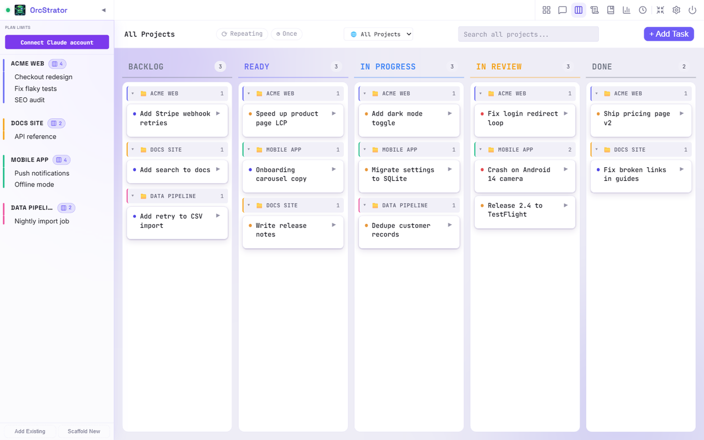

# OrcStrator

OrcStrator is a local web app that runs and organizes several Claude Code CLI
sessions side by side, with a task board to plan, start and review the work
each session does. It runs on your own machine and drives the official Claude
Code CLI.



Not affiliated with Anthropic. Requires your own Claude account.

OrcStrator starts the official Claude Code CLI (`claude`) for every session, so
the CLI must be installed and logged in before you start.

## Install (current version)

Download the Windows installer from
https://orcstrator-updates.00-nask.workers.dev/

- Windows only for now.
- The installer is not code signed yet. Windows SmartScreen will warn you: click
  "More info", then "Run anyway".

This repository is a delayed source snapshot, exported about once a month. The
installer is the up to date channel.

## Build from source

Prerequisites: Node.js 22 or newer, npm, git, and the Claude Code CLI installed
and logged in.

```bash
npm ci
npm run build
```

## Quickstart (Windows)

`orcstrator.bat` in the repository root is the Windows launcher entry point. It
opens the launcher (`installer/setup.ps1`), which starts OrcStrator for you.

## Run it yourself

After building, run it in production mode, where the server also serves the built client
on http://localhost:3334:

```bash
NODE_ENV=production npm start                         # macOS, Linux, Git Bash
$env:NODE_ENV = "production"; npm start               # Windows PowerShell
```

For development with hot reload:

```bash
npm run dev        # server on port 3334, client (Vite) on http://localhost:5174
```

Data lives in `~/.orcstrator-v2` by default. Set `ORCSTRATOR_DATA_DIR` to use
another folder, and `PORT` to change the server port.

## Privacy

OrcStrator has no telemetry and no analytics. Network traffic: the web UI loads
its fonts from Google Fonts; the server polls your Claude plan usage from
api.anthropic.com with your own Claude login; if you add an Anthropic API key,
chat naming and summaries call the Anthropic API; plus whatever the Claude Code
CLI itself sends.

For the usage poll, the server reads the Claude Code CLI's local credentials
file (`~/.claude/.credentials.json`) to get your login token. The poll runs
whenever you are signed in to the CLI, and it only talks to Anthropic.

## Updates

A copy without a `.git` folder (for example a ZIP download) never checks for
updates and trusts no release key unless you configure your own update URL and
key. A git clone only updates itself when it is an official install (the
private release config is present) or when you set ORC_GIT_AUTO_UPDATE=1;
otherwise the launcher runs your checkout as is and never contacts an update
server.

## Tests

```bash
npm run test:schedule
npm run test:server
node server/hooks/test/run-tests.mjs
npx tsx scripts/test-parser-permission.ts
cd worker && npm test
```

The launcher tests in `installer/` are PowerShell scripts for Windows, see
`.github/workflows/ci.yml` for how they run.

## Contributing and security

See [CONTRIBUTING.md](CONTRIBUTING.md) and [SECURITY.md](SECURITY.md).

## License

FSL-1.1-ALv2 (Functional Source License 1.1, Apache 2.0 future license). Each
release converts to the Apache License 2.0 two years after it is made
available. See [LICENSE](LICENSE). Third-party components are listed in
[NOTICE](NOTICE), with their full license texts in
[THIRD_PARTY_LICENSES](THIRD_PARTY_LICENSES).

Copyright 2026 Pareto 13 Ltd.

Created by Rodrigo Souza (rodrigonask.com).
